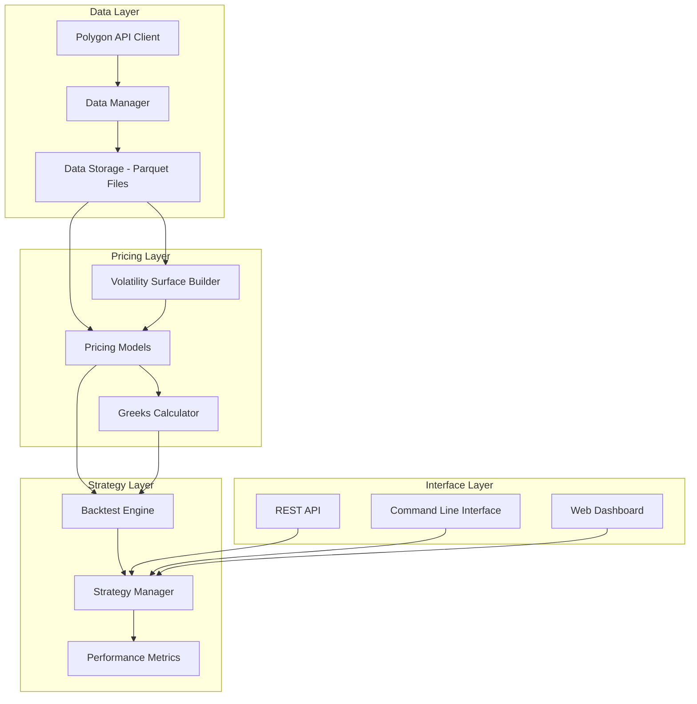

# SPX Options Pricing System Design

## Overview

The SPX Options Pricing System is a comprehensive quantitative finance platform designed for backtesting options trading strategies on the S&P 500 index. The system combines historical market data management, multiple options pricing models, volatility surface construction, and robust backtesting capabilities to enable accurate strategy evaluation across different market regimes.

The architecture follows a modular design with clear separation between data management, pricing engines, and backtesting components, allowing for independent scaling and maintenance of each subsystem.

## Architecture

### High-Level System Architecture



### Data Architecture

The system implements a tiered data storage strategy optimized for both long-term historical analysis and high-frequency recent data access:

**Tier 1: Long-term Historical Data (20 years)**

- Daily OHLC data for SPX, VIX, Treasury rates, dividend yields
- Stored in compressed Parquet format with date-based partitioning
- Optimized for analytical queries and backtesting across extended periods

**Tier 2: High-frequency Recent Data (1 year)**

- 1-minute granularity data for SPX and VIX
- Stored in Parquet format with monthly partitioning
- Enables intraday strategy analysis and high-frequency backtesting

## Components and Interfaces

### 1. Data Management System

#### Polygon API Client

```python
class PolygonClient:
    def get_daily_bars(self, symbol: str, start_date: date, end_date: date) -> pd.DataFrame
    def get_minute_bars(self, symbol: str, start_date: date, end_date: date) -> pd.DataFrame
    def get_options_chain(self, symbol: str, date: date) -> pd.DataFrame
    def get_treasury_rates(self, start_date: date, end_date: date) -> pd.DataFrame
    def get_dividend_data(self, symbol: str, start_date: date, end_date: date) -> pd.DataFrame
```

#### Data Storage Manager

```python
class DataStorageManager:
    def store_daily_data(self, data: pd.DataFrame, symbol: str, data_type: str) -> None
    def store_minute_data(self, data: pd.DataFrame, symbol: str, data_type: str) -> None
    def load_data(self, symbol: str, start_date: date, end_date: date, granularity: str) -> pd.DataFrame
    def migrate_to_cloud(self, s3_bucket: str, s3_prefix: str) -> None
```

### 2. Options Pricing Engine

#### Pricing Models Interface

```python
class PricingModel(ABC):
    @abstractmethod
    def price_option(self, spot: float, strike: float, time_to_expiry: float,
                    risk_free_rate: float, volatility: float, option_type: str) -> float

    @abstractmethod
    def calculate_greeks(self, spot: float, strike: float, time_to_expiry: float,
                        risk_free_rate: float, volatility: float, option_type: str) -> Dict[str, float]

class BlackScholesModel(PricingModel):
    # European options pricing implementation

class BinomialTreeModel(PricingModel):
    # American options pricing with early exercise

class MonteCarloModel(PricingModel):
    # Simulation-based pricing with variance reduction

class HestonModel(PricingModel):
    # Stochastic volatility model implementation
```

#### Volatility Surface Builder

```python
class VolatilitySurfaceBuilder:
    def build_surface(self, options_data: pd.DataFrame, spot_price: float) -> VolatilitySurface
    def interpolate_volatility(self, surface: VolatilitySurface, strike: float, time_to_expiry: float) -> float
    def extrapolate_wings(self, surface: VolatilitySurface) -> VolatilitySurface
    def validate_arbitrage_free(self, surface: VolatilitySurface) -> bool
```

### 3. Backtesting Engine

#### Strategy Framework

```python
class TradingStrategy(ABC):
    @abstractmethod
    def generate_signals(self, market_data: MarketData, current_positions: Portfolio) -> List[Order]

    @abstractmethod
    def risk_management(self, portfolio: Portfolio, market_data: MarketData) -> List[Order]

class BacktestEngine:
    def run_backtest(self, strategy: TradingStrategy, start_date: date, end_date: date) -> BacktestResults
    def calculate_performance_metrics(self, results: BacktestResults) -> PerformanceMetrics
    def generate_report(self, results: BacktestResults) -> BacktestReport
```

## Data Models

### Market Data Models

```python
@dataclass
class MarketData:
    timestamp: datetime
    spot_price: float
    volatility_index: float
    risk_free_rate: float
    dividend_yield: float
    options_chain: pd.DataFrame

@dataclass
class OptionsContract:
    symbol: str
    strike: float
    expiration: date
    option_type: str  # 'call' or 'put'
    bid: float
    ask: float
    last: float
    implied_volatility: float
    open_interest: int
    volume: int

@dataclass
class VolatilitySurface:
    strikes: np.ndarray
    expirations: np.ndarray
    volatilities: np.ndarray
    spot_price: float
    timestamp: datetime
```

### Portfolio and Position Models

```python
@dataclass
class Position:
    contract: OptionsContract
    quantity: int
    entry_price: float
    entry_date: datetime
    current_value: float
    greeks: Dict[str, float]

@dataclass
class Portfolio:
    positions: List[Position]
    cash: float
    total_value: float
    portfolio_greeks: Dict[str, float]
```

### Performance Models

```python
@dataclass
class PerformanceMetrics:
    total_return: float
    sharpe_ratio: float
    max_drawdown: float
    win_rate: float
    profit_factor: float
    var_95: float
    expected_shortfall: float
    calmar_ratio: float
```

## Error Handling

### Data Quality and Validation

- **Missing Data Handling**: Implement forward-fill and interpolation strategies for missing market data points
- **Data Validation**: Validate data integrity with range checks, outlier detection, and consistency verification
- **API Rate Limiting**: Implement exponential backoff and retry logic for Polygon API calls
- **Storage Failures**: Implement atomic writes and rollback mechanisms for data storage operations

### Pricing Model Errors

- **Numerical Stability**: Handle edge cases in pricing models (very short/long expirations, extreme strikes)
- **Convergence Issues**: Implement fallback pricing methods when primary models fail to converge
- **Arbitrage Detection**: Validate pricing results for arbitrage opportunities and flag inconsistencies

### Backtesting Errors

- **Position Sizing**: Implement position size limits and margin requirements validation
- **Liquidity Constraints**: Model realistic execution assuming limited market liquidity
- **Corporate Actions**: Handle stock splits, dividends, and other corporate actions affecting options

## Testing Strategy

### Unit Testing

- **Data Layer Tests**: Validate data retrieval, storage, and transformation operations
- **Pricing Model Tests**: Test pricing accuracy against known analytical solutions and market benchmarks
- **Greeks Calculation Tests**: Verify Greeks calculations using finite difference methods and analytical benchmarks
- **Volatility Surface Tests**: Test surface construction, interpolation, and arbitrage-free validation

### Integration Testing

- **End-to-End Backtesting**: Run complete backtests on known historical periods with verified results
- **Data Pipeline Testing**: Validate complete data flow from API to storage to pricing models
- **Performance Testing**: Measure system performance under various data loads and backtesting scenarios

### Validation Testing

- **Historical Pricing Validation**: Compare theoretical prices against historical market prices
- **Strategy Performance Validation**: Validate backtesting results against known strategy performance benchmarks
- **Risk Metrics Validation**: Verify risk calculations against industry-standard risk management systems

## Performance Considerations

### Data Access Optimization

- **Parquet Columnar Storage**: Leverage columnar format for efficient analytical queries
- **Data Partitioning**: Implement date-based partitioning for optimal query performance
- **Caching Strategy**: Implement intelligent caching for frequently accessed volatility surfaces and pricing data
- **Parallel Processing**: Utilize multiprocessing for independent pricing calculations and backtesting scenarios

### Memory Management

- **Streaming Data Processing**: Process large datasets in chunks to manage memory usage
- **Lazy Loading**: Load data on-demand rather than preloading entire datasets
- **Memory-Mapped Files**: Use memory mapping for large Parquet files to optimize access patterns

### Computational Efficiency

- **Vectorized Operations**: Leverage NumPy and Pandas vectorization for bulk calculations
- **GPU Acceleration**: Consider GPU acceleration for Monte Carlo simulations and large-scale matrix operations
- **Algorithmic Optimization**: Implement efficient algorithms for volatility surface interpolation and options pricing

## Security and Compliance

### Data Security

- **API Key Management**: Secure storage and rotation of Polygon API credentials
- **Data Encryption**: Encrypt sensitive data at rest and in transit
- **Access Control**: Implement role-based access control for different system components

### Compliance Considerations

- **Data Retention**: Implement data retention policies compliant with financial regulations
- **Audit Logging**: Maintain comprehensive audit logs for all system operations and data access
- **Backup and Recovery**: Implement robust backup and disaster recovery procedures for critical data

## Deployment and Scalability

### Local Development Environment

- **Docker Containerization**: Containerize all system components for consistent development environments
- **Configuration Management**: Use environment-specific configuration files for different deployment scenarios
- **Development Database**: Provide lightweight development setup with sample data

### Cloud Migration Strategy

- **S3 Data Migration**: Implement seamless migration from local Parquet files to S3 storage
- **Serverless Computing**: Consider AWS Lambda for on-demand pricing calculations
- **Managed Services**: Leverage cloud-managed databases and compute resources for scalability

### Monitoring and Observability

- **Performance Monitoring**: Implement comprehensive monitoring for system performance and data quality
- **Error Tracking**: Centralized error logging and alerting for system failures
- **Business Metrics**: Track key business metrics like pricing accuracy and backtesting performance
